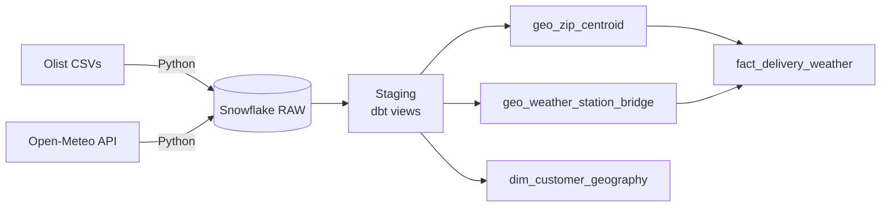
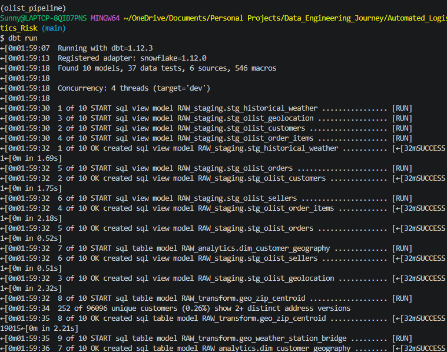
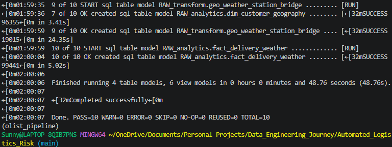
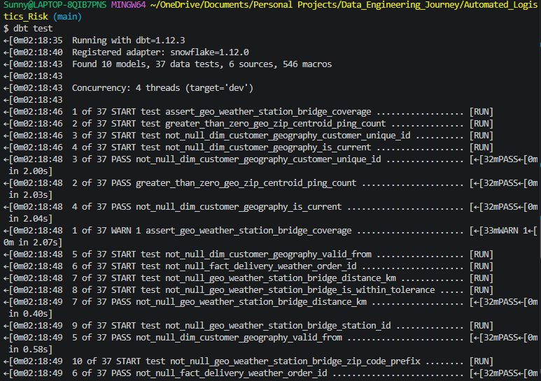
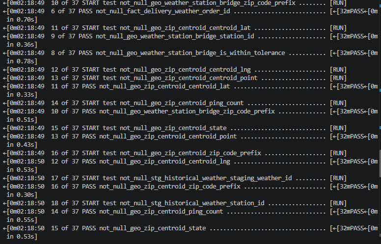
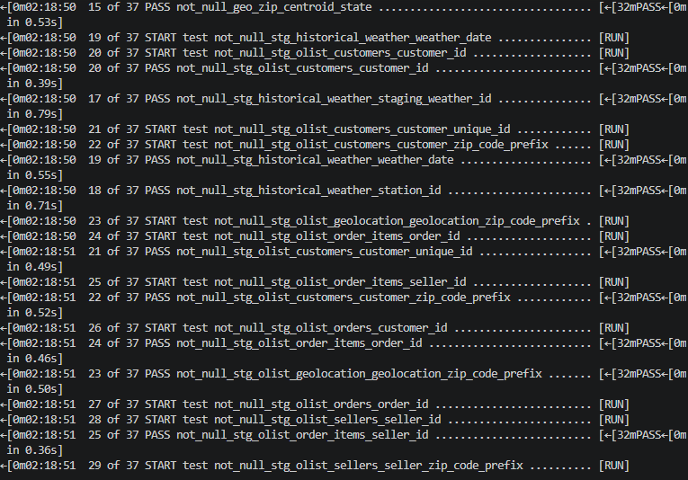
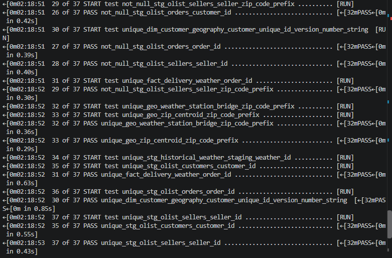
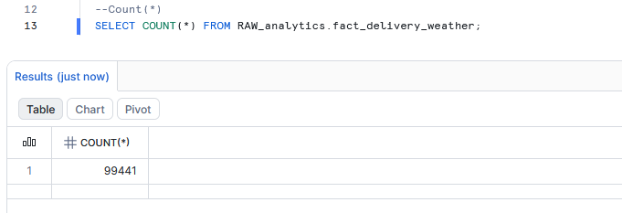
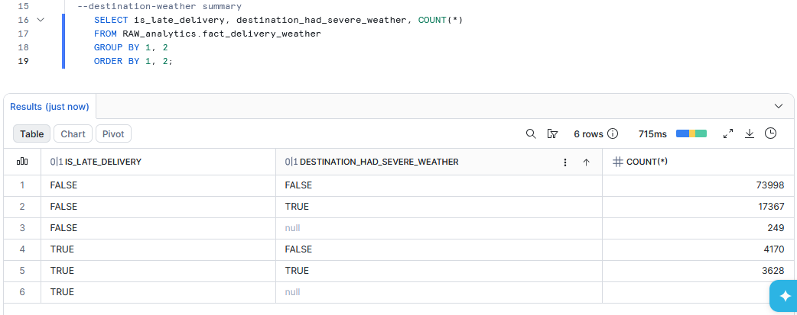
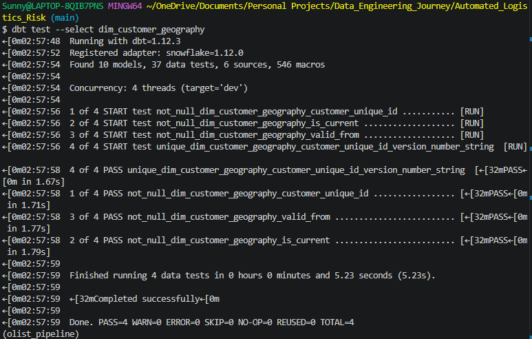

# Olist Weather-Delay Analysis

A data pipeline that joins historical Brazilian e-commerce orders (Olist, 2016–2018) with real historical weather to test whether severe weather is associated with late deliveries — built on **dbt Core + Snowflake**, with a layered staging → transform → mart architecture and a genuine Type 2 Slowly Changing Dimension.

> [!NOTE]
> This is a **historical audit**, not a live simulation. Olist's data is a static extract, so rather than relabeling old orders as "live" to demo a real-time pipeline, this project pulls the actual historical weather for the same dates and measures a real, verifiable correlation.

## Key finding

Across 99,441 orders, the overall late-delivery rate was **7.9%**.

| Weather location | No severe weather | Severe weather | Ratio |
|---|---|---|---|
| Destination (customer) | 5.3% late | 17.3% late | 3.2x |
| Origin (seller) | 5.7% late | 16.1% late | 2.8x |

*Severe weather = precipitation > 20mm or wind speed > 40 km/h on any day during the order's purchase-to-delivery window. A small share of orders (0.3% destination, 1.0% origin) have no weather match and are excluded from these percentages.*

> [!IMPORTANT]
> This is an **observed association, not a causal claim**. It doesn't control for confounds like regional remoteness or seasonality — a natural next step would be a regression isolating weather's independent effect.

See [`notebooks/analysis.ipynb`](notebooks/analysis.ipynb) for the same finding visualized, plus a look at the seasonality confound and the geocoding distance distribution.

## Architecture



- **Ingestion** (`scripts/load_to_snowflake.py`) — loads Olist CSVs and Open-Meteo historical weather directly into Snowflake, no intermediate object storage.
- **Staging** — one dbt view per raw source, light typing only.
- **Transform** — resolves the Olist-to-weather geocoding gap: zip-code-prefix centroids (median lat/lng) bridged to the nearest weather grid cell by geodesic distance, with a 50km QC tolerance.
- **Marts**:
  - `fact_delivery_weather` — one row per order, origin and destination weather joined and aggregated independently across each delivery window.
  - `dim_customer_geography` — Type 2 SCD built from Olist's real repeat-customer signal (`customer_unique_id`), not simulated change events.

## Data source notes

**Weather:** [Open-Meteo Historical Weather API](https://open-meteo.com/en/docs/historical-weather-api) (ERA5 reanalysis) — a gap-free global grid, chosen over station-based sources because Brazil's real weather station network is sparse outside major metros. The tradeoff: values are model-interpolated, not direct thermometer readings.

**SCD2 design:** Olist has no live change signal, so `dim_customer_geography` uses `customer_unique_id` (stable across a customer's orders, unlike the per-order `customer_id`) to detect real address changes between consecutive orders. Result: 252 of 96,096 customers (0.26%) show 2+ address versions — expected, since most Olist customers are one-time buyers.

> [!TIP]
> See [`CHANGE_SUMMARY.md`](CHANGE_SUMMARY.md) for the full history of design decisions and fixes, including the Snowflake-specific SQL syntax corrections made along the way.

## Status

- Staging, transform, and mart layers: built and tested against live Snowflake data.
- Weather ingestion: substantially complete (10M+ rows across 12,700+ grid cells). Ingestion was stopped once coverage stabilized, given diminishing returns against Open-Meteo's rate limit — an undocumented fair-use threshold on their historical archive endpoint, stricter than their published per-minute/hour limits for bulk multi-location requests. A small number of orders (under 1%) lack a weather match; see the caveat under Key finding.
- Built and demonstrated on a Snowflake trial account (no credit card, 30-day / $400 credit limit) — see [Setup](#setup) for reproducing locally.

## Setup

**Requirements:** Python 3.11+, a Snowflake account, dbt Core + dbt-snowflake.

> [!WARNING]
> Use a **conda** environment, not a plain `venv`. `cryptography` (a `snowflake-connector-python` dependency) ships a compiled Rust extension that fails to load on Windows under Python < 3.10 (`ImportError: DLL load failed`). conda-forge's pre-built binaries on Python 3.11 resolve this cleanly.

```bash
conda create -n olist_pipeline python=3.11 -y
conda activate olist_pipeline
conda install -c conda-forge cryptography snowflake-connector-python -y
pip install -r requirements.txt
```

1. Download the [Olist Brazilian E-Commerce dataset](https://www.kaggle.com/datasets/olistbr/brazilian-ecommerce) into `data/olist/`, renamed to `orders.csv`, `order_items.csv`, `customers.csv`, `sellers.csv`, `geolocation.csv`.
2. Create `.env` with your Snowflake credentials (see variable names in `scripts/load_to_snowflake.py`).
3. Copy `profiles.yml.template` to `~/.dbt/profiles.yml` with the same credentials.
4. In Snowsight:
   ```sql
   CREATE DATABASE IF NOT EXISTS OLIST_WEATHER_DB;
   CREATE SCHEMA IF NOT EXISTS OLIST_WEATHER_DB.RAW;
   ```
5. Run ingestion (resumable — safe to re-run if interrupted):
   ```bash
   python scripts/load_to_snowflake.py
   ```
6. Build and test:
   ```bash
   dbt run
   dbt test
   ```
7. Optional — open the exploratory notebook for visualized results:
   ```bash
   jupyter notebook notebooks/analysis.ipynb
   ```

## Screenshots

<details>
<summary>Pipeline execution and results</summary>

`dbt run` building all models:



`dbt test` — all data quality tests passing:





`fact_delivery_weather` row count, matching the source order count exactly:


Destination weather vs. late-delivery correlation:


`dim_customer_geography` SCD2 mart:


</details>

## Known limitations

- A small share of orders (0.3% destination, 1.0% origin) have no weather match and show `NULL` weather aggregates rather than zero, since ingestion was stopped at substantial-but-not-total coverage.
- Multi-seller orders in `fact_delivery_weather` reflect only the first seller's origin location, to preserve one-row-per-order grain.
- Weather is ERA5 reanalysis (model-interpolated), not raw station observations — see [Data source notes](#data-source-notes).

## Tech stack

Python · Snowflake · dbt Core · Open-Meteo Historical Weather API · Jupyter
