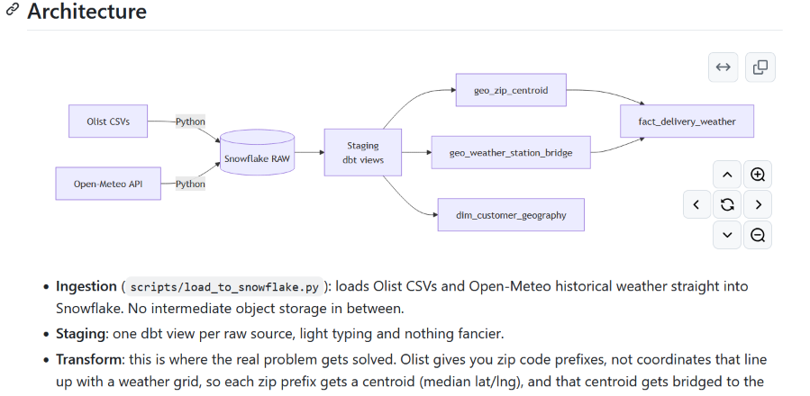
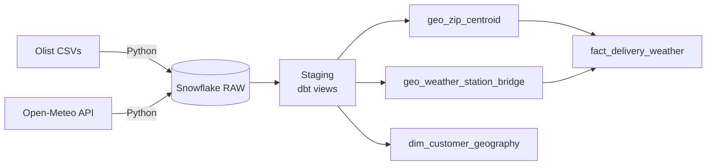
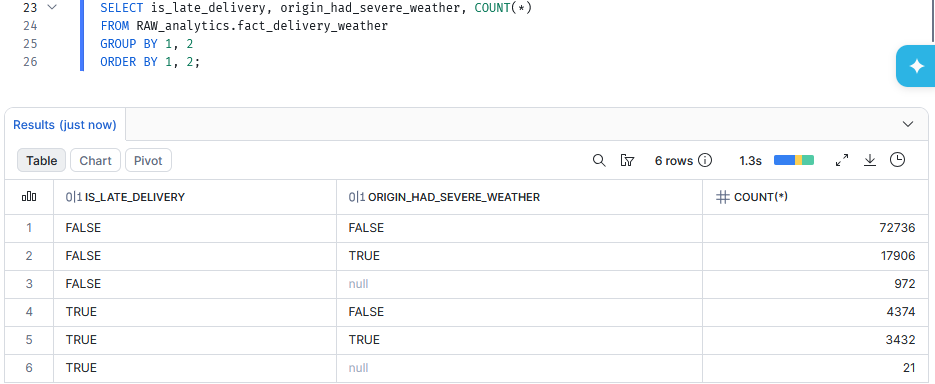

```markdown
# Olist Weather-Delay Analysis

Late deliveries cost trust, and weather is an obvious suspect. This project puts that hunch to the test: it joins two years of real Brazilian e-commerce orders (Olist, 2016 to 2018) with actual historical weather for those same dates and asks a simple question. When it storms, do packages show up late more often?

Built on **dbt Core + Snowflake**, with a proper staging → transform → mart architecture and a real Type 2 Slowly Changing Dimension, not a toy version of one.

> [!NOTE]
> This is a **historical audit**, not a live simulation. Olist's data is a static extract from 2018, so I wasn't going to pretend it was streaming in "live." Instead, I pulled the real weather for those exact historical dates and measured a correlation that actually happened, rather than faking a real-time demo on top of old data.

## Demo

[](https://youtu.be/No_hNBfRKsI?si=TsYUkdkEI1s6zIK1)

*Click through for a walkthrough of the pipeline running end to end, including the key finding.*

## Key finding

Across 99,441 orders, the overall late-delivery rate was **7.9%**.

| Weather location | No severe weather | Severe weather | Ratio |
|---|---|---|---|
| Destination (customer) | 5.3% late | 17.3% late | 3.2x |
| Origin (seller) | 5.7% late | 16.1% late | 2.8x |

*Severe weather means precipitation over 20mm or wind speeds over 40 km/h on any day during the order's purchase-to-delivery window. A small share of orders (0.3% destination, 1.0% origin) have no weather match yet and are excluded from these percentages.*

> [!IMPORTANT]
> This is an **observed association, not a causal claim**. It doesn't control for confounds like regional remoteness or seasonality. A logistic regression controlling for shipping distance and month would be the natural next step to isolate weather's actual effect.

Check out [`notebooks/analysis.ipynb`](notebooks/analysis.ipynb) for the same finding visualized, along with a look at the seasonality confound and the geocoding distance distribution.

## Architecture



- **Ingestion** (`scripts/load_to_snowflake.py`): loads Olist CSVs and Open-Meteo historical weather straight into Snowflake. No intermediate object storage in between.
- **Staging**: one dbt view per raw source, light typing and nothing fancier.
- **Transform**: this is where the real problem gets solved. Olist gives you zip code prefixes, not coordinates that line up with a weather grid, so each zip prefix gets a centroid (median lat/lng), and that centroid gets bridged to the nearest weather grid cell by geodesic distance, with a 50km quality-control tolerance built in.
- **Marts**:
  - `fact_delivery_weather`: one row per order, with origin and destination weather joined and aggregated independently across each delivery window.
  - `dim_customer_geography`: a genuine Type 2 SCD, built from Olist's real repeat-customer signal (`customer_unique_id`), not from simulated or fabricated change events.

## Data source notes

**Weather:** [Open-Meteo Historical Weather API](https://open-meteo.com/en/docs/historical-weather-api) (ERA5 reanalysis), a gap-free global grid. I chose this over station-based sources because Brazil's actual weather station network is sparse outside the major metros, and a gap-free grid means every order gets a weather value instead of silently dropping rural and interior locations. The tradeoff is honest: these values are model-interpolated, not direct thermometer readings.

**SCD2 design:** Olist has no live change signal to track, so instead of faking one, `dim_customer_geography` uses `customer_unique_id` (which stays stable across a customer's orders, unlike the per-order `customer_id`) to catch real address changes between consecutive orders. The result: 252 of 96,096 customers (0.26%) show 2+ address versions. That's expected, since most Olist customers only ever order once, and it's reported as a real data characteristic rather than something to dress up.

> [!TIP]
> [`CHANGE_SUMMARY.md`](CHANGE_SUMMARY.md) has the full history of design decisions and fixes along the way, including the Snowflake-specific SQL syntax corrections that came up more than once.

## Status

- Staging, transform, and mart layers: built and tested against live Snowflake data.
- Weather ingestion: substantially complete (10M+ rows across 12,700+ grid cells). I stopped ingestion once coverage stabilized, since I was chasing diminishing returns against Open-Meteo's rate limit: an undocumented fair-use threshold on their historical archive endpoint that turned out to be stricter than their published per-minute and per-hour limits for bulk multi-location requests. Under 1% of orders lack a weather match; see the caveat under Key Finding.
- Built and demonstrated on a Snowflake trial account (no credit card needed, 30-day / $400 credit limit). See [Setup](#setup) to reproduce it locally.

## Setup

**Requirements:** Python 3.11+, a Snowflake account, dbt Core + dbt-snowflake.

> [!WARNING]
> Use a **conda** environment, not a plain `venv`. `cryptography` (a `snowflake-connector-python` dependency) ships a compiled Rust extension that fails to load on Windows under Python < 3.10 (`ImportError: DLL load failed`). conda-forge's pre-built binaries on Python 3.11 fix this cleanly, and I learned that the hard way.

```bash
conda create -n olist_pipeline python=3.11 -y
conda activate olist_pipeline
conda install -c conda-forge cryptography snowflake-connector-python -y
pip install -r requirements.txt
```

1. Download the [Olist Brazilian E-Commerce dataset](https://www.kaggle.com/datasets/olistbr/brazilian-ecommerce) into `data/olist/`, renamed to `orders.csv`, `order_items.csv`, `customers.csv`, `sellers.csv`, `geolocation.csv`.
2. Create `.env` with your Snowflake credentials (variable names are in `scripts/load_to_snowflake.py`).
3. Copy `profiles.yml.template` to `~/.dbt/profiles.yml` with the same credentials.
4. In Snowsight, run:
   ```sql
   CREATE DATABASE IF NOT EXISTS OLIST_WEATHER_DB;
   CREATE SCHEMA IF NOT EXISTS OLIST_WEATHER_DB.RAW;
   ```
5. Run ingestion (it's resumable, so it's safe to re-run if interrupted):
   ```bash
   python scripts/load_to_snowflake.py
   ```
6. Build and test:
   ```bash
   dbt run
   dbt test
   ```
7. Optional: open the exploratory notebook to see the results visualized:
   ```bash
   jupyter notebook notebooks/analysis.ipynb
   ```

## Screenshots

<details>
<summary>Pipeline execution and results</summary>

`dbt run` building all models:


`dbt test`, all data quality tests passing:


`fact_delivery_weather` row count, matching the source order count exactly:


Destination weather vs. late-delivery correlation:


Origin weather vs. late-delivery correlation:


`dim_customer_geography` SCD2 mart:


</details>

## Known limitations

- A small share of orders (0.3% destination, 1.0% origin) have no weather match and show `NULL` weather aggregates instead of zero, since ingestion was stopped at substantial, not total, coverage.
- Multi-seller orders in `fact_delivery_weather` reflect only the first seller's origin location, to keep the grain at one row per order.
- Weather is ERA5 reanalysis (model-interpolated), not raw station observations. See [Data source notes](#data-source-notes) for why.

## Tech stack

Python · Snowflake · dbt Core · Open-Meteo Historical Weather API · Jupyter
```